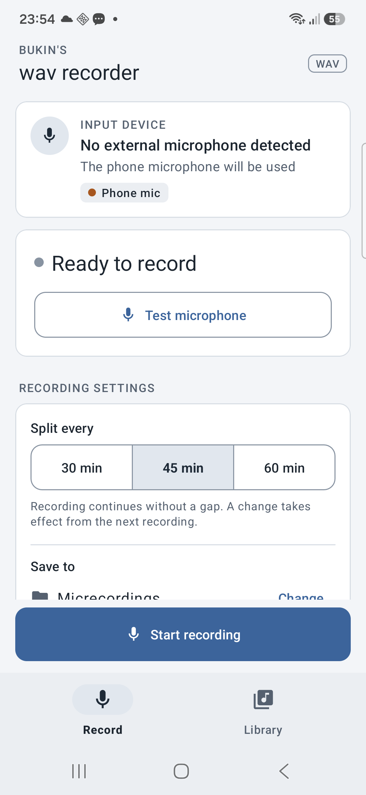

# WavRecorder

Simple WAV recording for Android, designed for USB microphones. You can also
use your phone's built-in mic.

The app selects a recording format automatically based on the microphone and
what Android supports.

  

## What you can do

- Record uncompressed audio with a live waveform.
- Keep recording in the background or with the screen off.
- Test your microphone without creating a file.
- Split long recordings into 30-, 45-, or 60-minute files.
- Save recordings to a folder of your choice.
- Listen back, adjust playback speed, and delete recordings individually or in bulk.

## Getting started

1. Connect your microphone, or use the phone's built-in mic.
2. Choose a save location and a file-splitting interval.
3. Tap **Start recording**, then **Stop & save** when you're done.
4. Open **Library** to listen to and manage your recordings.

## Compatibility

Requires Android 7.0 or newer and microphone permission.
Tested with the Insta360 Mic Air on the Samsung Galaxy A55.
Compatibility and available recording quality depend on the microphone and phone.

---

For build instructions and technical details, see the [developer guide](docs/DEVELOPMENT.md).
